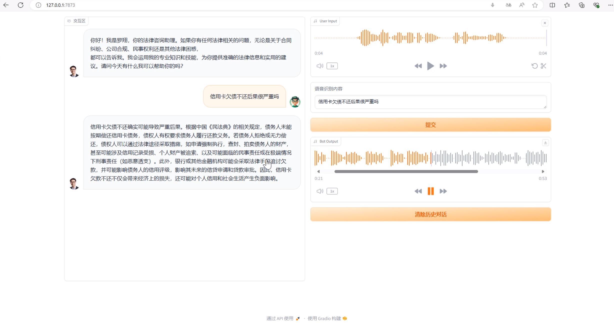

# 端到端语音交互AI法律助手
- ## 环境安装

    python版本：Python 3.8.19
    ```shell
    conda create -n cosyvoice python=3.8 -y
    conda activate cosyvoice
    pip install  pynini==2.1.5
    pip install dashscope
    apt update
    apt-get install sox libsox-dev
    pip install funasr
    pip install dashscope
    apt install ffmpeg

    # 配置SenseVoice
    git clone https://github.com/FunAudioLLM/SenseVoice.git
    cd SenseVoice
    pip install -r requirements.txt 

    # 配置CosyVoice
    git clone https://github.com/FunAudioLLM/SenseVoice.git
    cd 配置CosyVoice
    pip install -r requirements.txt 

    # 启动服务
    cd CosyVoice
    export PYTHONPATH=third_party/Matcha-TTS
    python AI-assitantbyTeachLuo.py
    ```

- ## 交互对话
<div align="center">

