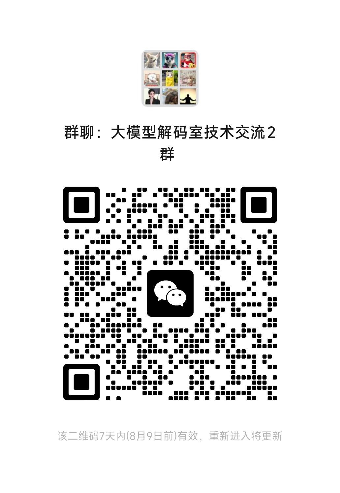

# 大模型解码室

聚焦垂直领域大模型以及场景化应用落地与最新动态以及技术讨论

目前分享的底层框架技术只是让大家可能根据自己的需求，对整个行业的上下游有一定的了解，可能不需要全部掌握，只需要深入掌握其中一部分就可以了，形成一个整体认知，大模型应用该怎么做，我们也在探讨，怎么赋能现有场景，基本每个场景都会是定制化的，这个领域大有可为，希望可以在这场AI变革中，帮助大家建立技术护城河

资料获取：公众号【大模型解码室】回复对应数字即可获取

在公众号中，发送对应课程名称的编号获取讲解视频和思维导图以及代码

 1. gemma2-2B部署微调，回复 1

2. Qwen2-7B 部署微调，回复2

3. 大模型全栈-数据介绍 回复3

4. 大模型全栈-提词工程 回复4

5. 训练微调 回复5

6. tokenizer 回复6

7. transformer原理-embedding原理-增量预训练技巧 回复7

8. 强化学习01-02 回复8

9. 强化学习03-05 回复9

10. dpo   回复10